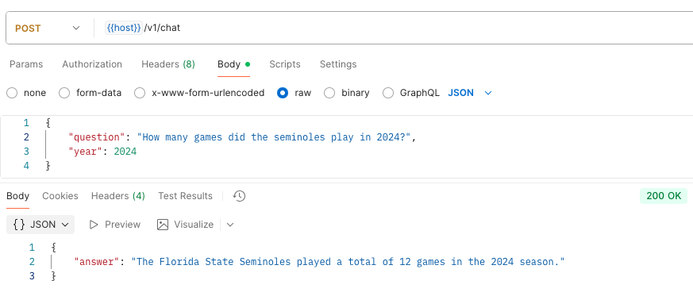

# CFB ATS API
Service to expose ATS model predictions for college football games

## Testing
Run the app with
`uvicorn main:app --reload`

## Next Steps
 - [x] Create mock endpoints
 - [ ] Create a natural language endpoint powered by OpenAI to answer questions about the dataset.
 - [ ] Fully define remaining endpoints
 - [ ] Build and expose specs

 ## Chatbot Progress
 **Example**
 ```bash
 POST /v1/chat
 {
    "question": "How many games did the seminoles play in 2024"
    "year": 2024
 }
```

**Response**
```json
{
    "answer": "The Florida State Seminoles played a total of 12 games in the 2024 season."
}
```


## Status
Adding in an endpoint to retrieve game data asynchronously. Stubbing other data to pull from CFBD. These endpoints will be used to pull data to build the model's dataset

## Completed
- [x] Scaffolding
- [x] Hooked up /games to pull from CFBD
- [x] Added live and health checks
- [x] Created endpoint stubs for teams, coaches, venues, lines, weather, score, and predict

## Future Goals
- [ ] Build and expose an endpoint to get weekly picks from the model and data from CFBD
- [ ] Allow a user to retrieve games, teams, weather, lines, coaches, etc.
- [ ] Allow a user to retrieve picks for specific teams of interests
- [ ] Stretch: Allow support for retrieving realtime game information to support push notifications

## Tech
- FastAPI and Pydantic (pending)
- skl or xgboost model loader
- Docker / similar
- Github Actions CI/CD

