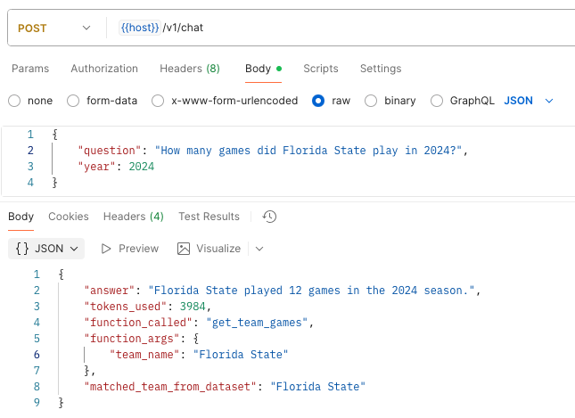

# CFB ATS API
Service to expose ATS model predictions for college football games

## Testing
Run the app with
`uvicorn main:app --reload`

## Next Steps
- [ ] Add additional functions to the chat endpoint

 ## Chatbot Progress
 I updated the chatbot to use function calling to support additional types of queries in the future. I also updated the team matching logic to properly identify "Florida State" instead of "Florida"

 **Example**
 ```bash
 POST /v1/chat
 {
    "question": "How many games did the Florida State play in 2024?"
    "year": 2024
 }
```

**Response**
```json
{
    "answer": "Florida State played 12 games in the 2024 season.",
    "tokens_used": 3984,
    "function_called": "get_team_games",
    "function_args": {
        "team_name": "Florida State"
    },
    "matched_team_from_dataset": "Florida State"
}
```


## Completed 
 - [x] Add live connectivity to games, coaches, lines, teams, venues, and weather endpoints
 - [x] Build a local caching mechanism to reduce calls to CFBD
- [x] Introduce a natural language endpoint powered by OpenAI to answer questions about the dataset
- [x] Use Pydantic for configuration management and data validations
- [x] Updated the natural language endpoint to use function calling

## Future Goals
- [ ] Integrate the ATS picks ML model
- [ ] Allow a user to retrieve picks for specific teams of interests
- [ ] Build out logging and expose specs
- [ ] Stretch: Allow support for retrieving realtime game information to support push notifications

## Tech
- FastAPI and Pydantic
- OpenAI GPT-4 for natural language interface
- Async HTTP requests using httpx
- File-based caching

Pending:
- skl or xgboost model loader
- Docker / similar
- Github Actions CI/CD

